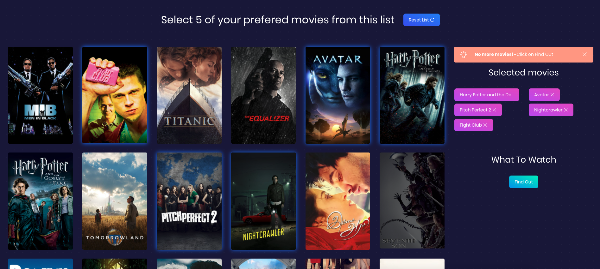

# What To Watch App
   

Tired of endless scrolling on Netflix because you cannot decide what to watch? Check out this app, it decides for you. Just click on five movies that you saw and liked and find out what to watch next! 

 

## Programmed with

React JS as the main framework. Also used Sass and Bootstrap 4.
## API 

Used themoviedb API to get movie recommendations: [https://developers.themoviedb.org/](https://developers.themoviedb.org/)

Get an API key and add it to a .env file as: `REACT_APP_MOVIE_API_KEY='your_api_key'`

## Quick start

- Clone the repo: `git clone https://github.com/Janjs/WhatToWatch.git`.
- Install dependencies: `npm install`.
- Run it!: `npm start`.

## Licensing

- Licensed under MIT
